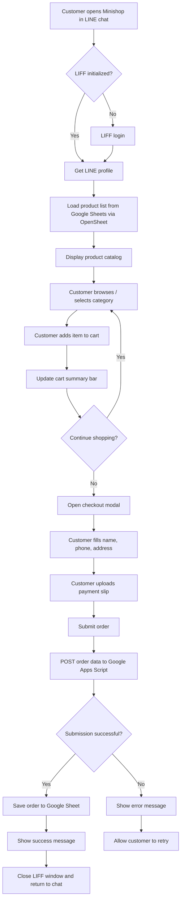

# Minishop Workflow Flowchart

Below is a high-level flowchart that shows how a customer order moves through the Minishop LIFF application.

## Step-by-Step Description

1. **Open App** – The user taps the LIFF link inside a LINE chat.
2. **LIFF Initialization** – The app checks whether the user is logged in. If not, it triggers LINE login.
3. **Profile** – The app fetches the LINE profile (user ID, display name, picture) and pre-fills the customer name.
4. **Load Products** – The product list is fetched from Google Sheets using the OpenSheet API.
5. **Browse & Filter** – The user browses products and filters by category.
6. **Add to Cart** – Selected items are added to the in-memory cart.
7. **Cart Summary** – A sticky bar at the bottom shows the running total.
8. **Checkout** – The user opens the checkout modal and fills in delivery details.
9. **Payment Slip** – The user uploads a payment-slip image, which is converted to Base64.
10. **Submit Order** – The app sends the complete payload to Google Apps Script via `fetch` POST.
11. **Backend Processing** – Google Apps Script writes the order details into a Google Sheet.
12. **Result** – On success, the app alerts the user and closes the LIFF window. On failure, it shows an error and allows a retry.
